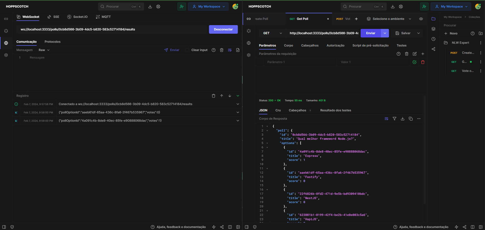

# **NLW Expert (Node.js)**

Projeto construído durante Imersão da NLW Expert de Node.js da Rocketseat com o objetivo de desenvolver um sistema de votação em tempo real no qual os usuários podem criar uma enquete e outros usuários podem lanças seus votos. O sistema gera uma classificação entre as opções e atualiza os votos em tempo real.

[🔗 Clique aqui para acessar](https://my-resume-bamarcheti.vercel.app/)

## **🛠 Tecnologias**

> ### _Banco de Dados_
>
> 
>
> ### _Server_
>
>   
>
> ### _Bibliotecas e Ferramentas_
>
>      

## **✨ Como executar**

- **_[Como executar](./README-install.md)_**

## **👩‍💻 HTTP**

- **_[HTTP](./http.md)_**

## **💛 Contato**

